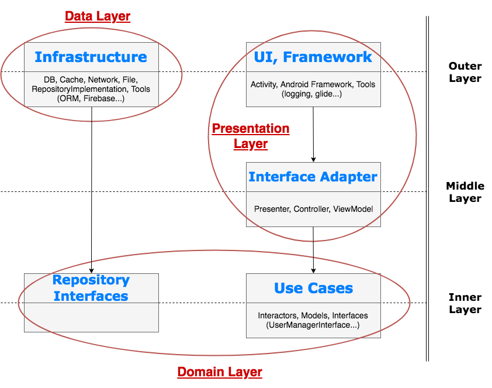

A simple Android app that demonstrates clean code architecture. 

The app should have two screens, as follows:Screen 1 should contain a list of posts. Tapping on a cell in the list, should take you to the second
screen.
Screen 2 is the detail screen for the selected post. Details to be shown about each post are:
- Post title
- Post body
- User name
- Number of comments
You get all the data you want from the following API endpoints:
- GET http://jsonplaceholder.typicode.com/posts
- GET http://jsonplaceholder.typicode.com/users
- GET http://jsonplaceholder.typicode.com/comments

 

